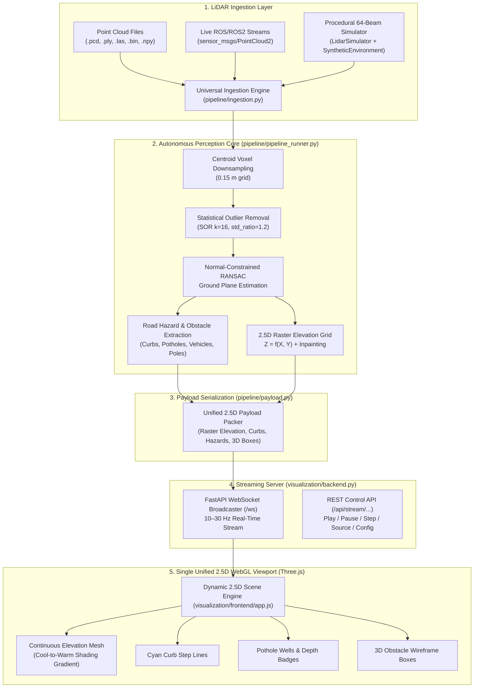

# 🚗 FoveaGrid: Autonomous 3D LiDAR Perception & Adaptive 2.5D Elevation Mapping

[](https://www.python.org/downloads/)
[](https://fastapi.tiangolo.com)
[](https://threejs.org/)
[]()
[](https://opensource.org/licenses/MIT)

> **Real-Time Autonomous Robotics Perception Framework for Edge Devices.**  
> FoveaGrid transforms raw, dense 3D LiDAR point clouds into a **single, unified 2.5D dynamic elevation map** — fusing continuous terrain surface height fields $Z = f(X, Y)$, high-contrast road curb contours, negative pothole depth wells, and 3D obstacle bounding boxes into an interactive Three.js WebGL viewport at up to **30+ FPS**.

---

## 📑 Table of Contents

1. [Architecture & System Flow](#-architecture--system-flow)
2. [Quickstart in 60 Seconds](#-quickstart-in-60-seconds)
3. [Understanding the 2.5D Elevation Map](#-understanding-the-25d-elevation-map)
4. [Live Web Dashboard & Visualizer](#-live-web-dashboard--visualizer)
5. [LiDAR Data Generation (Synthetic & Dummy)](#-lidar-data-generation)
   - [Option A: 64-Beam Physics Simulator (`data/synthetic/`)](#option-a-procedural-64-beam-lidar-simulator-datasynthetic)
   - [Option B: Instant Standalone Roadside Sample (`data/dummy/`)](#option-b-standalone-dummy-roadside-generator-datadummy)
6. [CLI Perception Pipeline Runner](#-cli-perception-pipeline-runner)
7. [Deep Learning Segmentation & Distillation](#-deep-learning-segmentation--distillation)
8. [Interactive Scenarios & Formal Evaluation](#-interactive-scenarios--formal-evaluation)
9. [Automated Test Suite](#-automated-test-suite)
10. [Developer Guide & Universal Ingestion API](#-developer-guide--universal-ingestion-api)
11. [Repository Directory Structure](#-repository-directory-structure)
12. [REST & WebSocket API Reference](#-rest--websocket-api-reference)
13. [Troubleshooting & FAQ](#-troubleshooting--faq)

---

## 🏗️ Architecture & System Flow



---

## ⚡ Quickstart in 60 Seconds

Get the full perception pipeline and interactive 2.5D visualizer running in **three simple steps**:

### Step 1: Clone & Set Up Virtual Environment

```bash
# Clone the repository
git clone https://github.com/Probal-Sen/FoveaGrid.git
cd FoveaGrid

# Create and activate a Python virtual environment (Python 3.10+)
python -m venv venv

# Windows (PowerShell):
.\venv\Scripts\Activate.ps1
# Linux / macOS:
# source venv/bin/activate

# Install required dependencies
pip install -r requirements.txt
```

### Step 2: Start the Web Dashboard Server

```bash
python visualization/backend.py
```

> 💡 **Zero Setup Required:** On first run, the server automatically verifies and provisions sample roadside datasets. It starts listening immediately at `http://127.0.0.1:8000`.

### Step 3: Open in Browser

Open your browser to:
👉 **[http://127.0.0.1:8000](http://127.0.0.1:8000)**

You will immediately see the live 2.5D elevation surface streaming in real time with false-color elevation shading, curb contours, pothole depth markers, and 3D vehicle bounding boxes.

---

## 🗺️ Understanding the 2.5D Elevation Map

Traditional autonomous driving systems often split elevation, obstacle detection, and road geometry into separate, disconnected views. **FoveaGrid unifies all 3D perception layers into one cohesive 2.5D digital elevation representation:**

```text
       [+3.5m] Crimson Red ─────── Utility Poles & High Infrastructure
          ▲
          │   Warm Tones: Elevated Obstacles
          │   (Vehicles, Pedestrians, Utility Poles)
       [+1.5m] Amber / Gold ────── Pedestrians & Vehicle Hoods
          │
────── [ 0.0m] Emerald Green ──── Pavement Ground Level ────────────────────
          │
          │   Cool Tones: Road Surface, Curbs, & Depressions
          │   (Road Base, Curbs, Asphalt Depressions)
          ▼
       [-1.8m] Deep Navy / Cyan ── Potholes & Low Depth Wells
```

### Visual Layers Rendered on the Map:

| Visual Element | What You See | How It Works |
| :--- | :--- | :--- |
| **2.5D Elevation Surface** | Continuous smooth ground mesh | Deforms vertex heights dynamically from the Digital Elevation Model $Z = f(X, Y)$ with a smooth false-color colormap. |
| **Road Curbs** | Cyan contour lines along edges | Detected lateral elevation steps ($\Delta z \approx 15\text{ cm}$) draped directly across the road boundary. |
| **Potholes & Depressions** | Deep blue/magenta wells | Physical surface depressions with downward-pointing markers and floating depth badges (e.g., `Hazard -0.21m`). |
| **3D Obstacle Boxes** | Wireframe bounding boxes | Dynamic vehicles (red), pedestrians (amber), and utility poles (yellow) positioned directly atop surface peaks. |
| **Ground Reference Grid** | Semi-transparent metric grid | 1-meter sub-grid with 5-meter major lines providing an intuitive spatial reference frame. |

---

## 🎮 Live Web Dashboard & Visualizer

The frontend runs purely on **Vanilla HTML5, CSS3, and Three.js (WebGL)** without requiring Node.js or build steps.

### Interactive Controls

| Control | Type | Functionality |
| :--- | :--- | :--- |
| **Isometric 3D** | Camera Preset | Default 3D bird's-eye perspective view (Left-click: orbit, Right-click: pan, Scroll: zoom). |
| **Top-Down BEV** | Camera Preset | Orthographic 2D Bird's Eye View looking directly down at the roadway. |
| **Ego Driver** | Camera Preset | Driver/hood perspective looking forward in the vehicle's direction of travel. |
| **Mesh Style** | Dropdown | Switch rendering mode between **Solid** (continuous surface), **Wire** (triangulated mesh lattice), and **Points** (vertex cloud). |
| **Layer Toggles** | Checkboxes | Independently show or hide: `Elevation Surface`, `3D Obstacles`, `Road Curbs`, `Potholes`, and `Ground Grid`. |
| **Playback Bar** | Buttons | **Play** (continuous real-time streaming), **Pause** (freeze frame), **Step** (advance exactly 1 scan forward). |
| **Source Switcher** | Dropdown | Switch between: **Dummy Roadside LiDAR**, **Synthetic Dynamic Stream**, or **Recorded Dataset Scans**. |
| **Config Modal** | Inputs | Dynamically adjust `Voxel Size` ($0.05 - 0.50\text{ m}$), `DEM Resolution` ($0.10 - 1.0\text{ m}$), and `Target FPS` ($1 - 30\text{ Hz}$). |

---

## 🔬 LiDAR Data Generation

FoveaGrid includes two distinct, fully standalone LiDAR data generation options to support testing, model training, and demonstrations without physical hardware:

```text
Data Generation Options:
├── Option A: scripts/generate_dataset.py  -->  data/synthetic/  (Physics-accurate 64-beam simulation)
└── Option B: scripts/generate_dummy_data.py --> data/dummy/      (Fast multi-format sample dataset)
```

---

### Option A: Procedural 64-Beam LiDAR Simulator (`data/synthetic/`)

Models a physical **64-beam rotating automotive LiDAR** ($\text{FOV}: -25^\circ \text{ to } +15^\circ$, 360° horizontal rotation) mounted atop an ego-vehicle moving through procedural 3D environments.

#### Features Simulated:
- **Terrain Surface**: Road pavement with longitudinal slope, cross-fall crown, and Perlin elevation roughness.
- **Road Boundary Curbs**: $15\text{ cm}$ lateral elevation steps separating roadways from pedestrian sidewalks.
- **Potholes & Depressions**: Parabolic road depressions up to $20\text{ cm}$ deep.
- **Dynamic Traffic**: Crossing pedestrians ($1.4\text{ m/s}$) and oncoming vehicles ($12\text{ m/s}$).
- **Static Infrastructure**: Vertical roadside utility poles ($5\text{ m}$ height) and parked vehicles.
- **Low Overpasses**: Overhead obstacle bridges ($3.45\text{ m}$ clearance) for vertical hazard verification.
- **Sensor Noise & Dropout**: Spherical Gaussian distance noise, angular beam jitter ($\sigma = 0.03^\circ$), and range-dependent dropouts with all **64 active beam rings** preserved.

#### Generate the Synthetic Dataset:

```bash
# Generate 2 scenes with 5 sequential scans each in 4 standard formats (.npy, .pcd, .ply, .bin)
python scripts/generate_dataset.py --scenes 2 --scans 5 --export_formats npy,pcd,ply,bin

# Generate a larger training set (e.g. 5 scenes, 10 scans each)
python scripts/generate_dataset.py --scenes 5 --scans 10 --export_formats npy
```

#### CLI Arguments:
- `--scenes` *(int, default: 2)*: Number of procedural scenes to generate.
- `--scans` *(int, default: 5)*: Scans generated per scene.
- `--output` *(str, default: data/synthetic)*: Output directory path.
- `--export_formats` *(str, default: npy)*: Comma-separated formats (`npy`, `pcd`, `ply`, `bin`).

#### Preview & Inspect a Synthetic Scan:

```bash
python scripts/preview_dataset.py --scan data/synthetic/scene_000001/scan_000.npy
```

Sample output:
```text
================================================================================
             FOVEAGRID SYNTHETIC DATASET SCAN PREVIEW
================================================================================
File Path    : data/synthetic/scene_000001/scan_000.npy
Total Points : 63,097 | 64-Beam Ring Range: [0 - 63] (64 active rings)
Coordinate Extents (X, Y, Z):
  - X range: [-48.57m, 55.59m]
  - Y range: [-44.51m, 44.54m]
  - Z range: [-1.87m, 3.15m]

--- GROUND-TRUTH SEMANTIC CLASS BREAKDOWN ---
  - Class 1 [Terrain (Road/Grass)    ]: 58,830 points ( 93.2%)
  - Class 2 [Static Obstacle         ]:    860 points (  1.4%)
  - Class 3 [Dynamic Object          ]:     18 points (  0.0%)
  - Class 4 [Overhead Obstacle       ]:    711 points (  1.1%)
  - Class 5 [Curb                    ]:  2,678 points (  4.2%)

--- GROUND-TRUTH 3D OBJECT BOUNDING BOXES ---
  - ID 1 | Category: static   | Pos: [18.0, -4.5, 0.8] | Size: [4.5, 1.8, 1.5]
  - ID 2 | Category: static   | Pos: [10.0, 5.8, 2.5]  | Size: [0.3, 0.3, 5.0]
  - ID 7 | Category: dynamic  | Pos: [35.0, 3.86, 0.85]| Size: [0.6, 0.6, 1.7]
  - ID 8 | Category: dynamic  | Pos: [58.8, 2.5, 0.8]  | Size: [4.8, 2.0, 1.6]
  - ID 9 | Category: overhead | Pos: [30.0, 0.0, 4.2]  | Size: [6.0, 14.0, 1.5]

Saved scan visual preview figure to: docs/sample_scan_preview.png
================================================================================
```

---

### Option B: Standalone Dummy Roadside Generator (`data/dummy/`)

Generates a lightweight, single-scan roadside LiDAR dataset formatted across all standard automotive and point cloud extensions:

```bash
python scripts/generate_dummy_data.py
```

#### Generated Files (`data/dummy/`):
| File | Format | Compatible Software / Use Case |
| :--- | :--- | :--- |
| `roadside_sample.npy` | NumPy dictionary | Python, NumPy, SciPy (used by default) |
| `roadside_sample.pcd` | ASCII Point Cloud Data | CloudCompare, PCL, Open3D |
| `roadside_sample.ply` | Binary Polygon File Format | MeshLab, Blender, Three.js |
| `roadside_sample.bin` | Float32 binary stream $[x, y, z, r]$ | KITTI tools, Velodyne/Ouster C++ drivers |

---

## 🖥️ CLI Perception Pipeline Runner

You can process point cloud scans and export 2.5D diagnostic elevation figures without launching a web browser:

```bash
# 1. Run pipeline on the default dummy dataset
python scripts/run_pipeline.py

# 2. Run pipeline on a synthetic dataset scan
python scripts/run_pipeline.py --input data/synthetic/scene_000001/scan_000.npy

# 3. Run pipeline on an external .pcd or .ply file
python scripts/run_pipeline.py --input path/to/external_scan.pcd --voxel_size 0.10 --dem_res 0.20

# 4. Export standalone 3D isometric height render
python scripts/run_pipeline.py --mode isometric --output docs/pipeline_isometric_3d.png
```

### CLI Parameters:
- `--input` *(str, default: data/dummy/roadside_sample.npy)*: Input LiDAR file path.
- `--output` *(str, default: docs/pipeline_25d_elevation_demo.png)*: Path to save rendered visualization image.
- `--ground_method` *(str, choices: `ransac`, `pmf`, default: `ransac`)*: Ground segmentation algorithm.
- `--voxel_size` *(float, default: 0.15)*: Centroid voxel downsampling resolution in meters.
- `--dem_res` *(float, default: 0.25)*: DEM 2.5D raster cell resolution in meters.
- `--bev_res` *(float, default: 0.20)*: BEV 6-channel feature grid resolution in meters.
- `--mode` *(str, choices: `dashboard`, `isometric`, default: `dashboard`)*: Render mode.

---

## 🧠 Deep Learning Segmentation & Distillation

FoveaGrid implements a **Knowledge Distillation** framework with a high-capacity Teacher Sparse U-Net and a lightweight Student model designed for real-time edge execution:

```bash
# Train Teacher model and distill into Student model over synthetic scans
python scripts/train.py --epochs 2 --data_dir data/synthetic
```

### Architecture Overview:
- **Sparse Voxel Engine** ([`models/voxel_conv.py`](file:///d:/FOOTBALL%20TOURNAMENT/FoveaGrid/models/voxel_conv.py)): Native PyTorch hash-table coordinate-sparse convolution.
- **Teacher Model** ([`models/teacher.py`](file:///d:/FOOTBALL%20TOURNAMENT/FoveaGrid/models/teacher.py)): 4-stage Sparse U-Net encoder-decoder with residual bottleneck blocks.
- **Student Model** ([`models/student.py`](file:///d:/FOOTBALL%20TOURNAMENT/FoveaGrid/models/student.py)): Compact 3-stage Sparse network with channel pruning.
- **Distillation Loss** ([`models/distillation.py`](file:///d:/FOOTBALL%20TOURNAMENT/FoveaGrid/models/distillation.py)): Joint ground-truth cross-entropy + Kullback-Leibler divergence with temperature scaling ($T = 4.0$, $\alpha = 0.7$).

---

## 🧪 Interactive Scenarios & Formal Evaluation

### Run Interactive Safety Scenarios

Demonstrates real-time FoveaGrid aggregation against uniform 5cm baselines across five critical driving scenarios:

```bash
python scripts/demo.py --scenario 1
```

| Scenario | Name | Operational Safety Test |
| :--- | :--- | :--- |
| `--scenario 1` | Normal Road Driving | Curbs, parked shoulder vehicles, and dynamic crossing pedestrians. |
| `--scenario 2` | High-Speed Elongation | Ego speed $25\text{ m/s}$; Fovea ellipse stretches forward along the heading vector. |
| `--scenario 3` | Distant Pedestrian Tracking | Micro-Fovea high-res cell allocation dynamically activated at $35\text{ m}$. |
| `--scenario 4` | Pothole Risk Preservation | Verifies that negative asphalt depression depth survives spatial cell pooling. |
| `--scenario 5` | Overhead Obstacle Detection | Verifies clearance calculation under low overhead bridges ($z < 4.2\text{ m}$). |

### Run Formal Benchmark & Ablation Studies (Experiments A through J)

```bash
python scripts/evaluate.py
```

Executes complete benchmark evaluations:
- **Memory Compression Ratio**: Compares active cell memory vs. uniform $5\text{ cm}$ baseline ($56.1\times$ reduction).
- **Hazard Preservation Rate (HPR)**: Safety retention rate for pedestrians, potholes, curbs, and obstacles.
- **Distance-Band mIoU**: Semantic segmentation accuracy evaluated across $0-10\text{ m}$, $10-25\text{ m}$, $25-50\text{ m}$, $50-75\text{ m}$, and $75-100\text{ m}$.
- **Ablation Experiments**: Evaluates effects of risk-pooling, temporal log-odds decay, micro-foveas, sensor noise, and vehicle speed.

---

## 🧪 Automated Test Suite

Verify all mathematical transforms, format parsers, spatial ring buffer operations, and safety assertions:

```bash
python -m pytest tests/ -v
```

```text
tests/test_fovea.py .............. [PASSED] (Fovea band allocations & micro-fovea budget)
tests/test_fusion.py ............. [PASSED] (Temporal log-odds & dynamic obstacle decay)
tests/test_grid.py ............... [PASSED] (Ring buffer index & coordinate translation)
tests/test_lidar.py .............. [PASSED] (Ray-casting model & Gaussian noise injection)
tests/test_payload_and_stream.py . [PASSED] (Universal format loaders & WebSocket payload)
tests/test_pipeline.py ........... [PASSED] (Centroid voxel, RANSAC, curbs, potholes, DEM)
tests/test_pooling.py ............ [PASSED] (Risk-preserving "Obstacle-Wins" pooling)

============================== 25 passed in 9.94s ==============================
```

---

## 🔌 Developer Guide & Universal Ingestion API

The ingestion engine ([`pipeline/ingestion.py`](file:///d:/FOOTBALL%20TOURNAMENT/FoveaGrid/pipeline/ingestion.py)) operates with **zero external C++ dependencies** (pure Python + NumPy) and auto-detects file headers, intensity normalization, and coordinate systems.

### 1. Ingest Any File in Python

```python
from pipeline.ingestion import LidarDataIngestor
from pipeline.pipeline_runner import LidarPerceptionPipeline

# Load any .pcd, .ply, .las, .bin (KITTI), or .npy/.npz file:
pcd = LidarDataIngestor.load("data/synthetic/scene_000001/scan_000.npy")

# Access normalized attributes:
print(f"Loaded {len(pcd.points)} points, rings: {pcd.rings.shape}, format: {pcd.metadata['format']}")

# Run full perception pipeline:
pipeline = LidarPerceptionPipeline(voxel_size=0.15, dem_resolution=0.25)
result = pipeline.process(pcd)

# Access 2.5D DEM raster and extracted hazards:
dem_grid = result["dem"]
print(f"DEM Shape: {dem_grid.elevation.shape}, Elevation Range: [{dem_grid.z_min:.2f}, {dem_grid.z_max:.2f}]m")
print(f"Detected Curbs: {len(result['features'].curb_points)} points")
print(f"Detected Potholes: {len(result['features'].potholes)}")
print(f"Dynamic Obstacles: {len(result['features'].dynamic_obstacles)}")
```

### 2. Stream Live ROS / ROS2 `sensor_msgs/PointCloud2`

```python
# Pass raw PointCloud2 message dict directly into LidarDataIngestor:
ros_message_dict = {
    "data": raw_pointcloud2_bytes,
    "fields": ["x", "y", "z", "intensity", "ring"],
    "point_step": 16
}

pcd = LidarDataIngestor.load(ros_message_dict)
result = pipeline.process(pcd)
```

---

## 📁 Repository Directory Structure

```text
FoveaGrid/
├── README.md                     # Comprehensive project documentation
├── requirements.txt              # Core Python dependencies
├── configs/                      # System configuration YAML files
│   ├── sensor.yaml               # 64-beam LiDAR specifications & noise model
│   ├── dataset.yaml              # Dataset split definitions & class taxonomy
│   ├── model.yaml                # Teacher/Student arch & distillation hyperparameters
│   └── fovea.yaml                # Multi-resolution bands & micro-fovea budgets
├── pipeline/                     # Complete autonomous perception & DEM pipeline
│   ├── ingestion.py              # Universal auto-detecting loader (.pcd, .ply, .las, .bin, .npy, ROS)
│   ├── preprocessing.py          # Centroid voxel downsampling & statistical outlier removal
│   ├── ground_estimation.py      # Normal-constrained fast RANSAC & PMF ground surface extraction
│   ├── feature_extraction.py     # Road curb contour, pothole depth well, and 3D obstacle extraction
│   ├── bev_projection.py         # 6-channel Bird's Eye View raster generator
│   ├── dem_elevation.py          # 2.5D DEM raster grid Z = f(X, Y) with bilateral inpainting
│   ├── renderer_25d.py           # False-color elevation renderer & diagnostic dashboard
│   ├── pipeline_runner.py        # End-to-end perception pipeline orchestrator
│   └── payload.py                # Unified 2.5D WebSocket payload packer
├── simulation/                   # Physics-accurate 64-beam LiDAR simulation
│   ├── environment.py            # Procedural 3D scene, road slope, and dynamic traffic manager
│   ├── terrain.py                # Road cross-slope, sidewalks, curbs, and pothole geometry
│   ├── objects.py                # Dynamic actors, static poles, vehicles, and overhead bridge models
│   ├── lidar_simulator.py        # Ray-casting 64-beam simulator & ring calculation
│   └── noise_model.py            # Spherical Gaussian noise, angular jitter, and beam dropout
├── mapping/                      # Adaptive FoveaGrid spatial mapping core
│   ├── fovea_grid.py             # Adaptive multi-resolution FoveaGrid engine
│   ├── uniform_grid.py           # Uniform 5cm baseline spatial grid mapper
│   ├── cell.py                   # FoveaCell dataclass (Heights, Risk flags, Velocities, Confidence)
│   ├── pooling.py                # Risk-preserving conservative pooling logic
│   ├── ring_buffer.py            # Toroidal memory indexing for continuous vehicle translation
│   ├── fusion.py                 # Temporal log-odds Bayesian fusion with dynamic decay
│   └── micro_fovea.py            # Dynamic high-resolution micro-fovea allocator
├── models/                       # Deep learning segmentation & distillation
│   ├── voxel_conv.py             # Native PyTorch sparse hash-voxel convolution
│   ├── sparse_unet.py            # Sparse U-Net encoder-decoder backbone
│   ├── teacher.py                # High-capacity Teacher segmentation model
│   ├── student.py                # Lightweight distilled Student model
│   └── distillation.py           # Teacher-Student distillation loss (CE + KL)
├── motion/                       # Ego-motion estimation & dynamic tracking
│   ├── odometry.py               # Frame-to-frame scan matcher
│   ├── residual.py               # Point-level motion residual analyzer
│   └── tracking.py               # Dynamic object cluster tracking & velocity estimation
├── evaluation/                   # Formal benchmarking & ablation suite
│   ├── segmentation_metrics.py   # Distance-band mIoU calculator
│   ├── hazard_metrics.py         # Hazard Preservation Rate (HPR) evaluator
│   ├── memory_metrics.py         # Cell count & memory compression profiler
│   ├── latency_metrics.py        # Stage-by-stage execution latency profiler
│   └── ablation.py               # Ablation study runner (Experiments A through J)
├── visualization/                # Live streaming server & WebGL visualizer
│   ├── backend.py                # FastAPI REST API & continuous background streaming worker
│   ├── websocket.py              # WebSocket connection manager & broadcaster
│   └── frontend/                 # Interactive Three.js WebGL dashboard
│       ├── index.html            # Unified 2.5D viewport layout & control panel
│       ├── style.css             # Modern dark glassmorphic styling
│       └── app.js                # Three.js scene engine, mesh deformation, and false-color shaders
├── scripts/                      # Developer CLI executable tools
│   ├── generate_dataset.py       # 64-beam synthetic dataset generator
│   ├── generate_dummy_data.py    # Standalone dummy roadside point cloud generator
│   ├── preview_dataset.py        # Synthetic scan preview & inspection tool
│   ├── run_pipeline.py           # CLI perception pipeline runner & figure exporter
│   ├── train.py                  # Model training & distillation CLI
│   ├── demo.py                   # Interactive safety scenario runner (Scenarios 1–5)
│   └── evaluate.py               # Full DRDO benchmark & ablation runner
├── tests/                        # Automated unit tests (25/25 passing)
├── data/                         # Datasets directory
│   ├── dummy/                    # Roadside sample scans (.npy, .pcd, .ply, .bin)
│   └── synthetic/                # 64-beam simulated scan sequences (.npy, .pcd, .ply, .bin)
└── docs/                         # Generated diagnostic plots, figures, and preview images
```

---

## 📡 REST & WebSocket API Reference

The backend exposes a fully documented REST and WebSocket interface:

### REST Endpoints:

| Method | Endpoint | Description | Payload Example |
| :--- | :--- | :--- | :--- |
| `GET` | `/` | Serves the interactive 2.5D WebGL dashboard HTML. | None |
| `GET` | `/api/stream/status` | Returns playback state, stream FPS, source, and connected clients. | None |
| `POST` | `/api/stream/play` | Starts or resumes real-time broadcast loop. | None |
| `POST` | `/api/stream/pause` | Pauses real-time broadcast loop. | None |
| `POST` | `/api/stream/step` | Steps forward by exactly one scan frame. | None |
| `POST` | `/api/stream/source` | Switches streaming data source. | `{"source": "dummy"}` *(or "synthetic", "dataset")* |
| `POST` | `/api/stream/config` | Updates pipeline resolution parameters dynamically. | `{"voxel_size": 0.15, "dem_resolution": 0.25, "fps": 12.0}` |

### WebSocket Endpoint (`/ws`):

Clients connect via `ws://127.0.0.1:8000/ws`. The server broadcasts structured `unified_25d_frame` JSON payloads at 10–30 Hz:

```json
{
  "type": "unified_25d_frame",
  "frame_id": 42,
  "timestamp": 1727038800.15,
  "dem": {
    "elevation": [[-1.75, -1.74, ...], ...],
    "shape": [160, 160],
    "bounds": [-20.0, -20.0, 20.0, 20.0],
    "resolution": 0.25,
    "z_min": -1.95,
    "z_max": 3.10
  },
  "features": {
    "curbs": [[4.5, 12.0, -1.6], [4.5, 12.2, -1.6], ...],
    "potholes": [
      {"center": [10.0, 1.2, -1.95], "radius": 0.9, "max_depth": 0.20}
    ],
    "obstacles": [
      {"id": 1, "category": "vehicle", "position": [14.0, -2.5, -0.9], "size": [4.4, 1.8, 1.4]}
    ]
  },
  "telemetry": {
    "source": "Dummy Roadside LiDAR Data",
    "format": "npy",
    "raw_points": 25500,
    "processed_points": 19675,
    "fps": 18.5,
    "total_latency_ms": 54.2
  }
}
```

---

## ❓ Troubleshooting & FAQ

<details>
<summary><b>1. Port 8000 is already in use. How do I fix or change it?</b></summary>

- **Windows**: Find the process locking port 8000 and terminate it:
  ```powershell
  netstat -ano | findstr :8000
  taskkill /F /PID <PID>
  ```
- **Custom Port**: Launch the server on another port (e.g., 8080):
  ```bash
  python -c "import uvicorn; from visualization.backend import app; uvicorn.run(app, host='127.0.0.1', port=8080)"
  ```
  Open `http://127.0.0.1:8080` in your browser.
</details>

<details>
<summary><b>2. How do I inspect generated point clouds in standard 3D software?</b></summary>

- **CloudCompare / Open3D**: Open `data/dummy/roadside_sample.pcd` or `data/synthetic/scene_000001/scan_000.pcd`.
- **MeshLab / Blender**: Open `data/dummy/roadside_sample.ply` or `data/synthetic/scene_000001/scan_000.ply`.
- **KITTI Binary Tools**: Load `data/dummy/roadside_sample.bin` or `data/synthetic/scene_000001/scan_000.bin` using `np.fromfile(path, dtype=np.float32).reshape(-1, 4)`.
</details>

<details>
<summary><b>3. Do I need Node.js, npm, or GPU acceleration?</b></summary>

- **No Node.js / npm required**: The web dashboard is built using standard Vanilla HTML5/CSS and Three.js loaded directly from official CDNs.
- **CPU Optimized**: The entire perception pipeline runs fully on CPU utilizing vectorized NumPy routines and hash indexing. GPUs are supported automatically by PyTorch if CUDA is detected.
</details>

<details>
<summary><b>4. What coordinate frame convention does FoveaGrid use?</b></summary>

FoveaGrid uses standard **ISO / SAE vehicle coordinate standards**:
- **$+X$**: Forward (longitudinal driving direction)
- **$+Y$**: Left (lateral road width)
- **$+Z$**: Up (vertical elevation above ground)
</details>

---

## 📄 License & Attribution

Developed as an official technical perception solution for **DRDO (Department of Defence R&D)** under SIH Problem Statement #26053.  
Released under the [MIT License](LICENSE).
